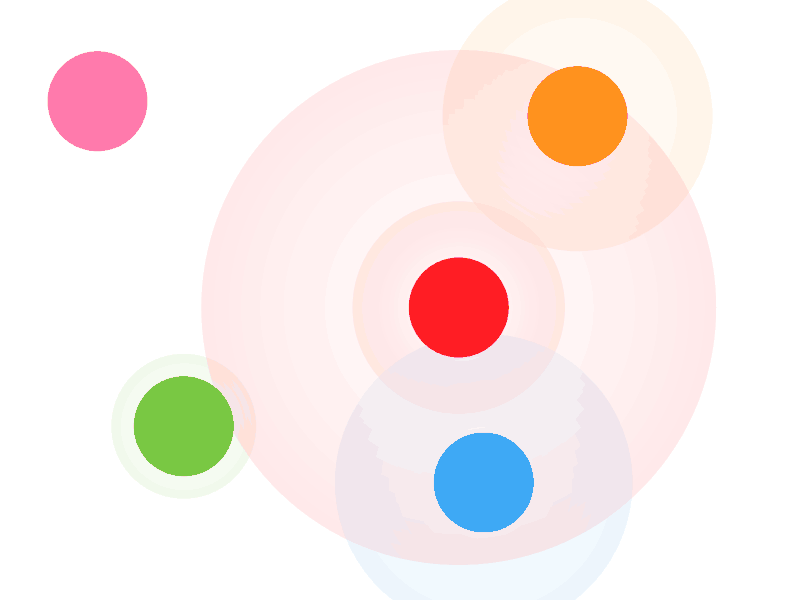

MusicalBucket
=============

Interesting experiment that lets you play a simple instrument.
Made using OpenFrameworks with the following addons: ofxCv, ofxMidi & ofxXmlSettings.

What it does
============
The application starts with a calibration phase in which you will be asked to select balls of multiple colors. It will then start tracking those balls in real time with a camera (using OpenCV).

Once your setup is ready, you can start playing by touching and moving the balls. Every time a ball is touched a virtual expansive wave is released, making the touched ball sound but also other balls near as the expansive wave gets to them.

This software acts as a controller only, sending MIDI notes into a MIDI channel. On the other end of the channel, you should have a generator such as Ableton Live to produce music. This let you have a very different sets of arrangements to play with.

Art Concept
===========

